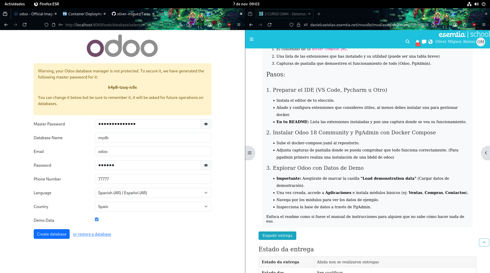
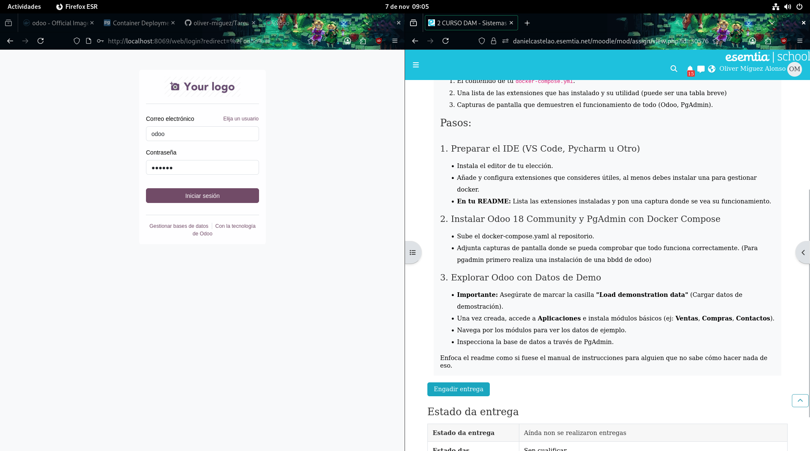
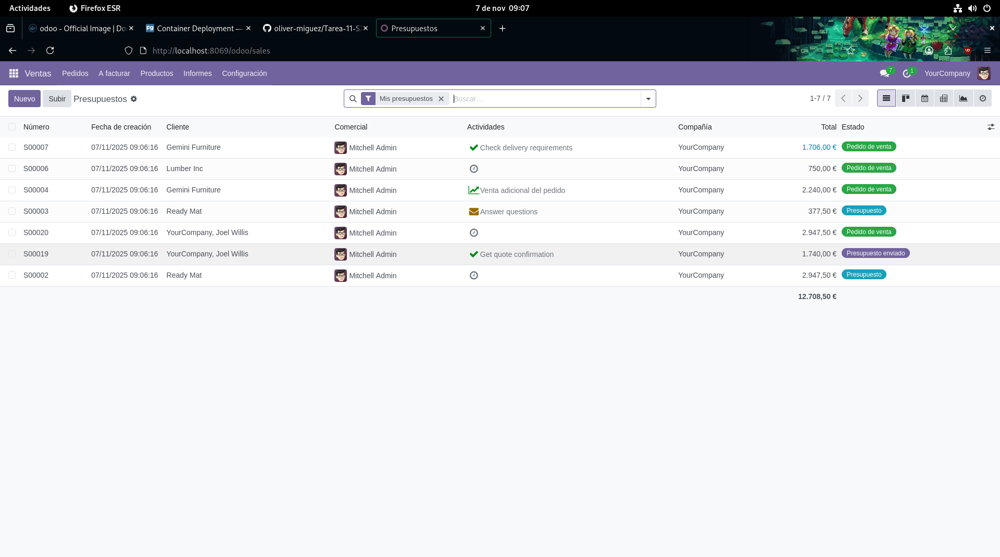
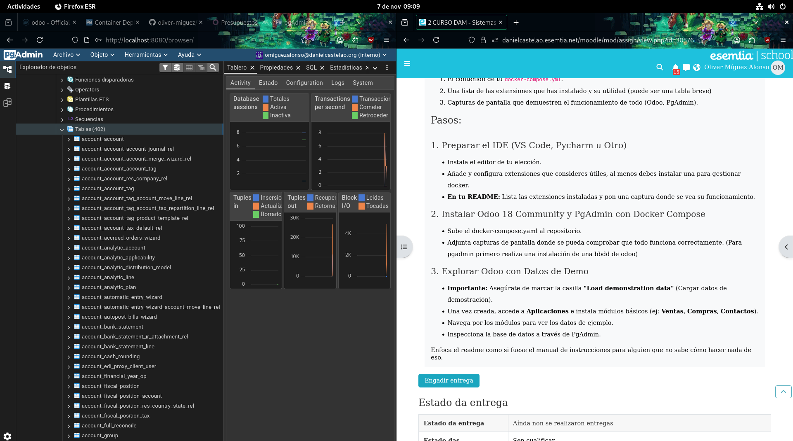

# PRIMER PASO
## Pluguins intalados en el ide

# Instalación Odoo

Si nuestro archivo yaml está correctamente configurado 
con los puertos añadidos y las variables de entorno necesarias para cada imagen 
si intentamos acceder a odoo a través de:

        localhost:8069

Observamos lo siguiente:

Donde añadimos los parámetros configurados en el Docker compose que creamos.

Si todo está bien colocado cuando accedamos observamos lo siguiente:

Añadimos el correo y la contraseña que hemos usado antes, y por último accedemos y buscamos e instalamos
tanto "Ventanas", "Contactos" y "Compras" dentro de odoo

De esta manera podremos ver que todo funcione

A  continuación en PgAdmin, accedemos al puerto:

    localhost:8080
Y añadimos al igual que odoo los datos correspondientes que configuramos en el enviroment del docker compose
en la ventana del PgAdmin, dentro de este, le damos a añadir servidor, en la ventana de conexión
le pasamos los parametros de nuestra base de datos definida en el docker compose y listo.

